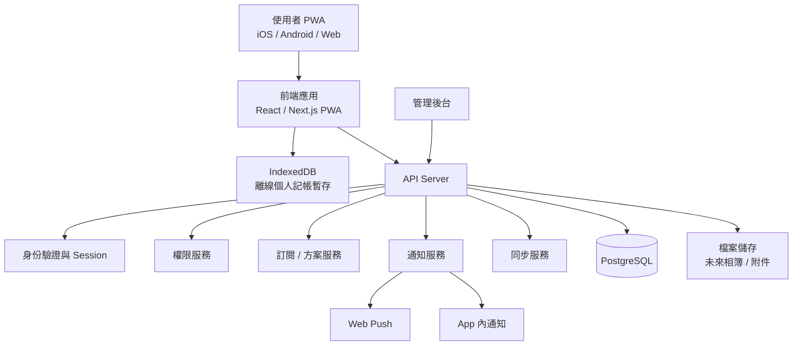

# Family OS 系統架構

## 1. 架構目標

- 支援多家庭、多成員、多角色。
- 所有家庭資料互相隔離。
- 權限判斷必須存在於 API 層。
- 支援 PWA，能同時服務 Web、iOS、Android 使用者。
- 離線僅支援新增個人記帳，協作功能需在線上操作。
- 支援未來擴充行程、相簿、備忘錄、訂閱管理等模組。

## 2. 建議技術

- 前端：Next.js + React PWA
- 後端：Node.js / NestJS 或 Next.js API Route
- 資料庫：PostgreSQL
- 離線資料：IndexedDB
- 同步策略：API polling，預設每 30 分鐘
- 通知：App 內通知 + Web Push
- 檔案儲存：S3 / Supabase Storage，MVP 可先預留
- 權限：RBAC + 資源層覆寫

## 3. 系統架構圖

## 4. 模組邊界

### 帳號與家庭模組

負責使用者、家庭、家庭成員、兒童簡易帳號、家庭切換。

### 權限模組

負責角色權限、資源覆寫權限、API 操作授權判斷。

### 個人記帳模組

負責個人帳戶、個人交易、分類、離線暫存與同步。

### 共用基金模組

負責家庭基金、基金交易、基金權限、基金餘額。

### 任務模組

負責任務建立、指派、完成、重複任務、審核流程。

### 積分模組

負責家庭內成員積分餘額與積分流水。

### 願望模組

負責願望提出、實現者接受 / 駁回、雙方定價、兌換與完成。

### 通知模組

負責 App 內通知與 Web Push。

### 方案與廣告模組

負責免費 / 付費限制、廣告展示、功能解鎖、匯出限制。

### 管理後台

負責營運者查看註冊家庭數、訂閱狀態、廣告管理、帳號管理。

## 5. 同步策略

- 預設每 30 分鐘同步一次。
- 使用者重新整理後取得最新資料。
- 離線只允許新增個人記帳。
- 協作資料修改前必須檢查是否有未同步個人交易。
- 若有未同步資料，需先完成同步才能修改協作功能。

## 6. 權限策略

權限採混合制：

- 角色提供預設權限。
- 重要資源可覆寫權限。
- API 層每次操作都必須驗證權限。

資源權限至少支援：

- 查看
- 新增
- 編輯
- 刪除
- 審核
- 調整積分
- 管理基金
- 匯出資料

## 7. 未來擴充方向

未來模組應以家庭、成員、權限、通知、關聯物件為基礎接入，例如：

- 行程表
- 相簿
- 備忘錄
- 訂閱管理
- 家庭事件
- AI 整理與分析
