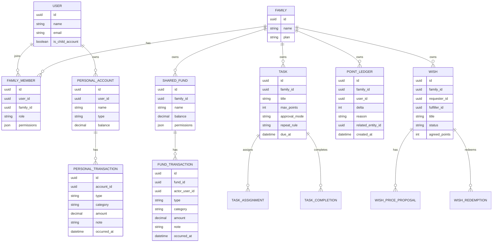
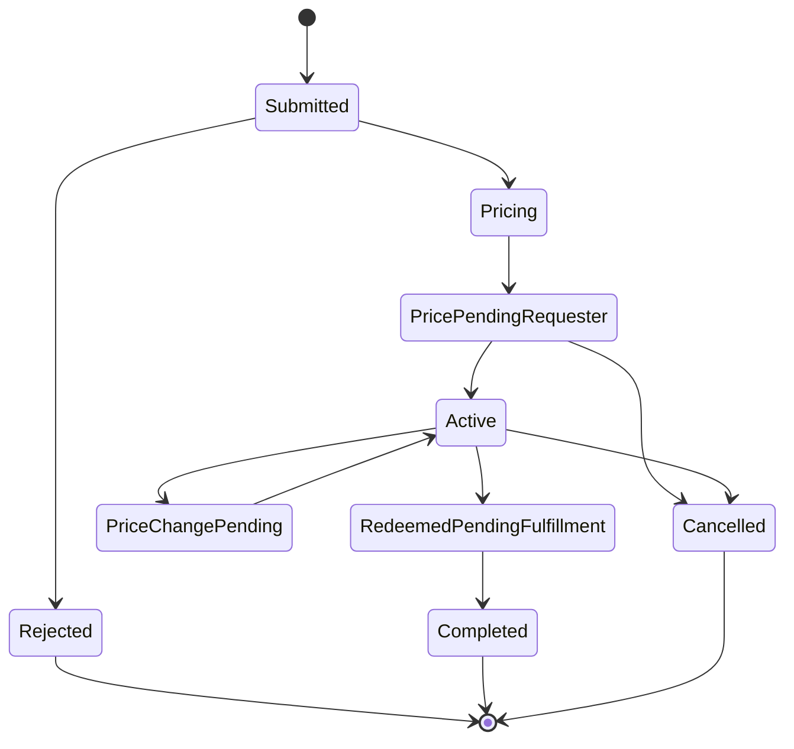

# Family OS 核心資料模型

## 1. ER 圖

## 2. 主要實體說明

### USER

代表一個使用者。可為一般帳號或家長建立的兒童簡易帳號。

### FAMILY

代表一個家庭空間。所有協作資料都隸屬於某個家庭。

### FAMILY_MEMBER

代表使用者與家庭的關係。包含角色與權限覆寫。

### PERSONAL_ACCOUNT

代表個人記帳本底下的資產帳戶，例如現金、銀行 A、電子支付。

### PERSONAL_TRANSACTION

代表個人帳戶中的收入或支出。每筆交易必須屬於一個帳戶。

### SHARED_FUND

代表家庭共用基金。App 只記錄基金餘額與交易，不綁定真實銀行帳戶。

### FUND_TRANSACTION

代表基金存入或支出。需記錄操作者與備註。

### TASK

代表家庭任務。包含最高積分、發分模式、期限與重複規則。

### TASK_ASSIGNMENT

代表任務指派對象。任務可指派單人、多人，或不指定。

### TASK_COMPLETION

代表任務完成與審核狀態。

### POINT_LEDGER

代表積分流水。任何加分、扣分、手動調整都必須產生紀錄。

### WISH

代表願望。由提出者建立，可指定實現者。

### WISH_PRICE_PROPOSAL

代表願望價格提案。價格修改需雙方同意。

### WISH_REDEMPTION

代表願望兌換紀錄。兌換後扣除積分，等待實現者完成。

## 3. 願望狀態機

