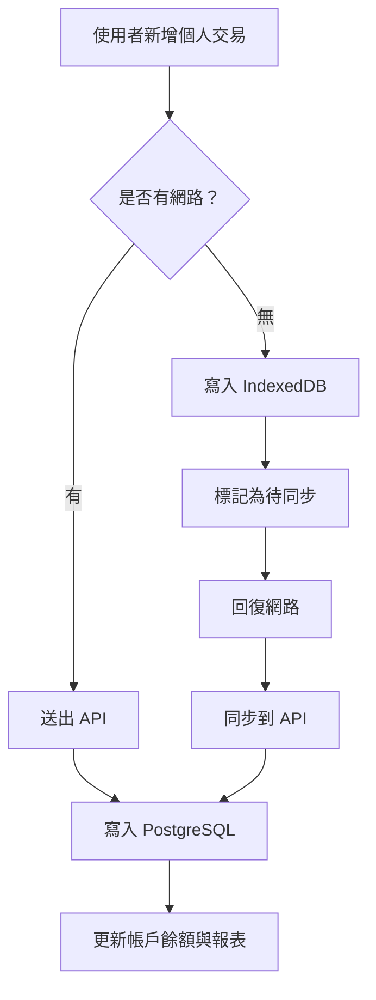
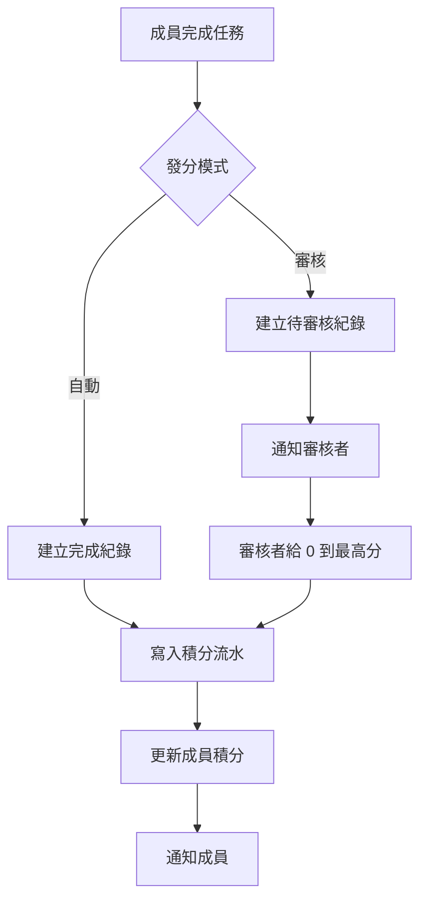
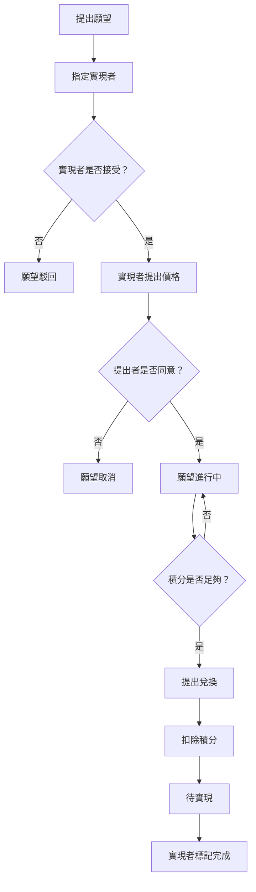
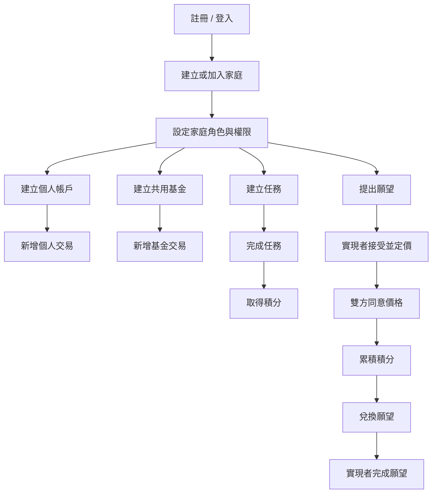

# Family OS 流程圖

## 1. 個人離線記帳資料流程

```mermaid
flowchart TD
    A["使用者新增個人交易"] --> B{"是否有網路？"}
    B -->|有| C["送出 API"]
    C --> D["寫入 PostgreSQL"]
    D --> E["更新帳戶餘額與報表"]

    B -->|無| F["寫入 IndexedDB"]
    F --> G["標記為待同步"]
    G --> H["回復網路"]
    H --> I["同步到 API"]
    I --> D
```

## 2. 任務發分資料流程

```mermaid
flowchart TD
    A["成員完成任務"] --> B{"發分模式"}
    B -->|自動| C["建立完成紀錄"]
    C --> D["寫入積分流水"]
    D --> E["更新成員積分"]
    E --> F["通知成員"]

    B -->|審核| G["建立待審核紀錄"]
    G --> H["通知審核者"]
    H --> I["審核者給 0 到最高分"]
    I --> D
```

## 3. 願望兌換資料流程

```mermaid
flowchart TD
    A["提出願望"] --> B["指定實現者"]
    B --> C{"實現者是否接受？"}
    C -->|否| D["願望駁回"]
    C -->|是| E["實現者提出價格"]
    E --> F{"提出者是否同意？"}
    F -->|否| G["願望取消"]
    F -->|是| H["願望進行中"]
    H --> I{"積分是否足夠？"}
    I -->|否| H
    I -->|是| J["提出兌換"]
    J --> K["扣除積分"]
    K --> L["待實現"]
    L --> M["實現者標記完成"]
```

## 4. 用戶流程圖

```mermaid
flowchart TD
    A["註冊 / 登入"] --> B["建立或加入家庭"]
    B --> C["設定家庭角色與權限"]
    C --> D["建立個人帳戶"]
    C --> E["建立共用基金"]
    C --> F["建立任務"]
    C --> G["提出願望"]

    D --> H["新增個人交易"]
    E --> I["新增基金交易"]
    F --> J["完成任務"]
    J --> K["取得積分"]
    G --> L["實現者接受並定價"]
    L --> M["雙方同意價格"]
    M --> N["累積積分"]
    N --> O["兌換願望"]
    O --> P["實現者完成願望"]
```
